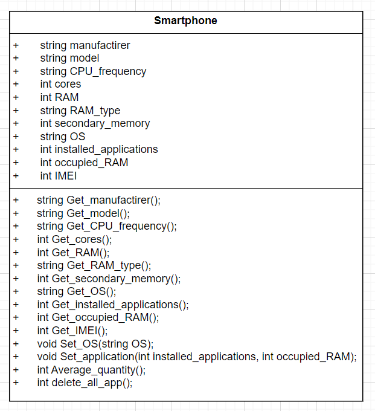
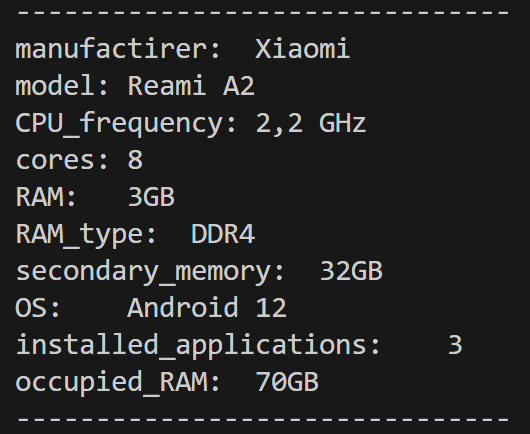
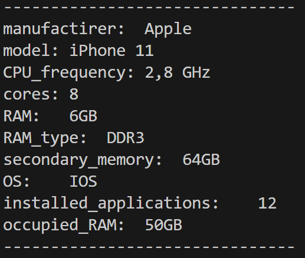
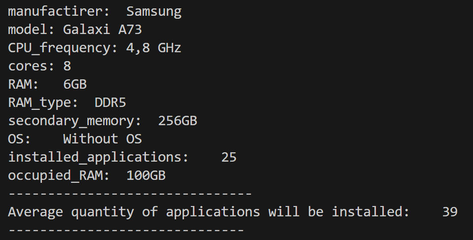
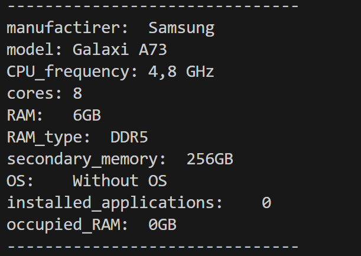

# smartphone
<div align="center">

МИНИСТЕРСТВО ОБРАЗОВАНИЯ НОВОСИБИРСКОЙ ОБЛАСТИ

Государственное автономное профессиональное образовательное учреждение Новосибирской области

«Новосибирский колледж печати и информационных технологий»

<br> <br> <br>

ОТЧЁТ

по лабораторной работе №1

«Реализация класса, моделирующий смартфон»

по дисциплине: «Основы алгоритмизации»

<br> <br>

Выполнил: <br> <br>
Студент гр. 9-22, ИСиП: <br>
Андрущук Д. В.	<br>
Вариант 2

Преподаватель: <br> <br>
Зеленев П.А. <br>

</div>

<br> <br> <br>

<p align="center">Новосибирск 2024 г</p>

<br> <br> <br>

# Оглавление

1. Цель и задачи

2. Тестовые данные и результаты программы

3. Свойства класса

4. Конструкторы класса

5. Методы класса

    5.1. Реализация методов

6. Проектирование функции main

    6.1. Логика создания

    6.2. Реализация функции main

    6.2.1.  Содержание .h файла. Объявление класса, полей и методов.

    6.2.2.  Создание объектов

7. Тестирование программы

8. Выводы

<br> <br>
# Цель и задачи

Цель: разработать класс, который позволяет создавать объекты и хранить данные о них

Задачи:

1. Создание файла .h где будет создан класс Смартфон с необходимыми полями и методами

2. Создать файл .cpp и в нем написать реализацию методов класса

3. Написать функцию main, которая отражает работу всех методов класса.

4. Сделать обработку ошибок

# Тестовые данные и результаты программы

| Входные данные | ожидаемые результаты программы |
|----------------|---------------------------------|
| Ввод информации о телефоне со всеми характеристиками <br> <br> "Xiaomi", "Reami A2", "2,2 GHz", 8, 3, "DDR4", 32 "Android 12", 3, 70, 12345 |  manufactirer:  Xiaomi <br> model: Reami A2 <br> CPU_frequency: 2,2 GHz <br> cores: 8 <br> RAM:   3GB <br> RAM_type:  DDR4 <br> secondary_memory:  32GB  <br> OS:    Android 12 <br> installed_applications:    3 <br> occupied_RAM:  70GB   |
| Ввод информации без ОС и установленных приложений <br> <br>"Apple", "iPhone 11", "2,8 GHz", 8, 6, "DDR3", 64, 76895 <br> Установка ОС значение "IOS" <br>и 12 приложений, которые занимают 50 ГБ | manufactirer:  Apple <br> model: iPhone 11 <br> CPU_frequency: 2,8 GHz<br> cores: 8<br> RAM:   6GB<br> RAM_type:  DDR3<br> secondary_memory:  64GB<br> OS:    IOS<br> installed_applications:    12  <br>    occupied_RAM:  50GB |
| Ввод информации о телефоне без ОС и последущей установки <br> "Samsung", "Galaxi A73", "4,8 GHz", 8, 6, "DDR5", 256, 88897 <br> Установка 25 приложений, которые занимают 100 ГБ и расчет среднего количества приложений | manufactirer:  Samsung <br> model: Galaxi A73 <br>CPU_frequency: 4,8 GHz <br>cores: 8 <br>RAM:   6GB <br>RAM_type:  DDR5 <br>secondary_memory:  256GB <br> OS:    Without OS <br>installed_applications:    25   <br>   occupied_RAM:  100GB <br> Average quantity of applications will be installed:    39 |
| Удаление всех приложений с этого же телефона | manufactirer:  Samsung <br> model: Galaxi A73 <br> CPU_frequency: 4,8 GHz <br> cores: 8 <br> RAM:   6GB <br> RAM_type:  DDR5 <br> secondary_memory:  256GB <br> OS:    Without OS <br> installed_applications:    0 <br> occupied_RAM:  0GB <br>

# Свойства класса

| Свойство | Тип и ограничения |
|----------|-------------------|
|производитель|строка, не пустая|
|модель |строка, не пустая|
|частота ЦПстрока, не пустаяУ|строка, не пустая, должно быть число|
|количество ядер ЦПУ|число больше чем 0|
|объём оперативной памяти (ОП)|число больше чем 0|
|тип ОП|строка, не пустая|
|объём вторичной памяти (ВП)|число больше чем 0|
|операционная система (ОС)|строка, не пустая, может быть не задано|
|количество установленных приложений|число не меньше 0, может быть не задано|
|объём занимаемой приложениями ВП|число не меньше 0, может быть не задано, не может быть 0, если предыдущий показатель не 0|
|IMEI|число, это цифровой код|
 
# Конструкторы класса

Разроботано 3 конструктора для класса

1. Конструктор со всеми параметрами

```cpp
Smartphone::Smartphone(string manufactirer, string model, string CPU_frequency, int cores, int RAM,  string RAM_type, int secondary_memory, string OS,  int installed_applications, int occupied_RAM, int IMEI)
{
    this->manufactirer = manufactirer;
    this->model = model;
    this->CPU_frequency = CPU_frequency;
    this->cores = cores;
    this->RAM = RAM;
    this->RAM_type = RAM_type;
    this->secondary_memory = secondary_memory;
    this->OS = OS;
    this->installed_applications = installed_applications;
    this->occupied_RAM = occupied_RAM;
}
```

2. Конструктор без ОС

```cpp
Smartphone::Smartphone(string manufactirer, string model, string CPU_frequency, int cores, int RAM,  string RAM_type, int secondary_memory,  int installed_applications, int occupied_RAM, int IMEI)
{
    this->manufactirer = manufactirer;
    this->model = model;
    this->CPU_frequency = CPU_frequency;
    this->cores = cores;
    this->RAM = RAM;
    this->RAM_type = RAM_type;
    this->secondary_memory = secondary_memory;
    this->OS = "Without OS";
    this->installed_applications = installed_applications;
    this->occupied_RAM = occupied_RAM;
}
```


3. Конструктор без ОС и установленных приложений

```cpp
Smartphone::Smartphone(string manufactirer, string model, string CPU_frequency, int cores, int RAM,  string RAM_type, int secondary_memory, int IMEI)
{
    this->manufactirer = manufactirer;
    this->model = model;
    this->CPU_frequency = CPU_frequency;
    this->cores = cores;
    this->RAM = RAM;
    this->RAM_type = RAM_type;
    this->secondary_memory = secondary_memory;
    this->OS = "Without OS";
    this->installed_applications = 0;
    this->occupied_RAM = 0;
}
```
# Методы класса

UML диаграмма отражает методы класса и тип возвращаемого значения. Методы начинающиеся на Set_ устанавливают соответствующее поле, с Get_ возвращают значение поля.



## Реализация методов

1. Возврат производителя

```cpp
string Smartphone::Get_manufactirer()
{
    return this->manufactirer;
}
```
2. Возврат модели

```cpp
string Smartphone::Get_model()
{
    return this->model;
}
```
3. Возврат частоты ЦПУ

```cpp
string Smartphone::Get_CPU_frequency()
{
    return this->CPU_frequency;
}
```
4. Возврат количества ядер

```cpp
int Smartphone::Get_cores()
{
    return this->cores;
}
```
5. Возврат объема оперативной памяти

```cpp
int Smartphone::Get_RAM()
{
    return this->RAM;
}
```

6. Возврат типа оперативной памяти

```cpp
string Smartphone::Get_RAM_type()
{
    return this->RAM_type;
}
```
7. Возврат объема вторичной памяти

```cpp
int Smartphone::Get_secondary_memory()
{
    return this->secondary_memory;
}
```
8. Возврат типа операционной системы

```cpp
string Smartphone::Get_OS()
{
    return this->OS;
}
```
9. Возврат количества установленных приложений

```cpp
int Smartphone::Get_installed_applications()
{
    return this->installed_applications;
}
```
10. Возврат занятой приложениями памяти

```cpp
int Smartphone::Get_occupied_RAM()
{
    return this->occupied_RAM;
}
```
11. Возврат IMEI

```cpp
int Smartphone::Get_()
{
    return this->IMEI;
}
```
12. Установка операционной системы

```cpp
void Smartphone::Set_OS(string OS)
{
    this->OS = OS;
}
```
13. Установка приложений

```cpp
void Smartphone::Set_application(int installed_applications, int occupied_RAM)
{
    if ((installed_applications == 0 && occupied_RAM == 0) || (installed_applications != 0 && occupied_RAM != 0))
    {
        this->installed_applications = installed_applications;
        this->occupied_RAM = occupied_RAM;
    }
    else
        throw "Error";
}
```
14. Расчет среднего количества приложений, которые можно установить

```cpp
int Smartphone::Average_quantity()
{
    int res = 0;
    if(installed_applications!=0 && secondary_memory - occupied_RAM > 0)
    {
        int one = this->occupied_RAM / this->installed_applications;
        int free = this->secondary_memory - this->occupied_RAM;
        res = free / one;
    }
    return res;
}
```
15. Удаление всех приложений

```cpp
int Smartphone::delete_all_app()
{
    this->occupied_RAM = 0;
    this->installed_applications = 0;
}
```
# Проектирование функции main

## Логика создания

1. Создание вспомогательной функции, которая будет выводить информацию о конкретном устройстве.

2. Создание 1 объекта класса и заполнение всех свойств. Далее вывод на экран информации. Так мы проверим все Get_ методы

3. Создание 2 объекта класса и заполнение всего, кроме ОС и приложений и далее установка ОС и приложений. Вывод на экран информации. Так мы проверим Set_ методы.

4. Создание 3 объекта класса и заполнение аналогично предыдущего примера и установка приложений, далее расчет среднего количества приложений, которые можно установить. Вывод на экран. Так мы проверим метод Average_quantity(). 

5. Удаление всех приложений у этого же устройства и вывод на экран информации.

## Реализация функции main

### Содержание .h файла. Объявление класса, полей и методов.

```cpp
#pragma once
#include <string>
using namespace std;

class Smartphone
{
    private:
        string manufactirer;
        string model;
        string CPU_frequency;
        int cores;
        int RAM;
        string RAM_type;
        int secondary_memory;
        string OS;
        int installed_applications;
        int occupied_RAM;
        int IMEI;

    public:
        Smartphone();
        Smartphone(string manufactirer, string model, string CPU_frequency, int cores, int RAM,  string RAM_type, int secondary_memory, string OS,  int installed_applications, int occupied_RAM, int IMEI);
        Smartphone(string manufactirer, string model, string CPU_frequency, int cores, int RAM,  string RAM_type, int secondary_memory,  int installed_applications, int occupied_RAM, int IMEI);
        Smartphone(string manufactirer, string model, string CPU_frequency, int cores, int RAM,  string RAM_type, int secondary_memory, int IMEI);
        string Get_manufactirer();
        string Get_model();
        string Get_CPU_frequency();
        int Get_cores();
        int Get_RAM();
        string Get_RAM_type();
        int Get_secondary_memory();
        string Get_OS();
        int Get_installed_applications();
        int Get_occupied_RAM();
        int Get_IMEI();

        void Set_OS(string OS);
        void Set_application(int installed_applications, int occupied_RAM);
        int Average_quantity();
        int delete_all_app();


};
```

### Подключение класса и методов из .h файла

```cpp
#include "book.h"
#include <string>
#include <iostream>
using namespace std;
```

### Функция на вывод информации о конкретном объекте

```cpp
void info(Smartphone &phone)
{
    cout << "-------------------------------" << endl;
    cout << "manufactirer:  " << phone.Get_manufactirer() << endl;
    cout << "model: " << phone.Get_model() << endl;
    cout << "CPU_frequency: " << phone.Get_CPU_frequency() << endl;
    cout << "cores: " << phone.Get_cores() << endl;
    cout << "RAM:   " << phone.Get_RAM() << "GB" << endl;
    cout << "RAM_type:  " << phone.Get_RAM_type() << endl;
    cout << "secondary_memory:  " << phone.Get_secondary_memory()<< "GB" << endl;
    cout << "OS:    " << phone.Get_OS() << endl;
    cout << "installed_applications:    " << phone.Get_installed_applications() << endl;
    cout << "occupied_RAM:  " << phone.Get_occupied_RAM() << "GB" << endl;
    cout << "-------------------------------" << endl;

}
```

### Создание объектов
 
```cpp
int main()
{
    Smartphone phone1("Xiaomi", "Reami A2", "2,2 GHz", 8, 3, "DDR4", 32,"Android 12", 3, 70, 12345);
    info(phone1);


    Smartphone phone2("Apple", "iPhone 11", "2,8 GHz", 8, 6, "DDR3", 64, 76895);

    phone2.Set_OS("IOS");
    phone2.Set_application(12, 50);
    info(phone2);

    Smartphone phone3("Samsung", "Galaxi A73", "4,8 GHz", 8, 6, "DDR5", 256, 88897);
    phone3.Set_application(25, 100);
    info(phone3);
    cout << "Average quantity of applications will be installed:    " << phone3.Average_quantity() << endl;
    cout << "------------------------------" << endl;


    phone3.delete_all_app();
    info(phone3);


    return 0;
}
```

# Тестирование программы

Все приведенные тесты пройдены. Теоретические представления и результаты программы совподают

Результаты программы представлены ниже









# Выводы

1. Объекты помогают ориентироваться в программе, ей могут пользоваться посторонние разработчики. 

2. Объекты соединяют методы и поля в одно целое. Это позволяет сократить код и упростить работу разработчику.

3. Приватные поля дают возможность избежать неправильного использования программы, такое как подмена данных или удаление их.

4. С помощью объектов в данной работе телефон представлен со всеми характеристиками, это гороздо удобнее чем хранить 1 строку с набором тех же характеристик и каждый раз ее разделять на части. В объектах данные хранятся все отдельно и никогда не перепутаются.


